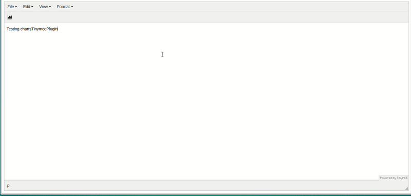

# Charts TinyMCE Plugin

With this plugin you able to add charts into your content.
This plugin using [Chartist.js](https://gionkunz.github.io/chartist-js/) libary for rendering graphs.



## How to test it:

```
git clone https://github.com/Axel186/charts-tinymce-plugin.git
cd charts-tinymce-plugin
npm install
npm start
```

Now go to `http://localhost:8080`.

## How to build the dist files:

```
npm run build
```

Now you got your own `dist` folder - minimized version of plugin already there.

### Configure your TinyMce:

```Javascript
tinymce.init({
  selector: 'textarea',
  plugins: 'chartsTinymcePlugin',
  external_plugins: {'chartsTinymcePlugin': 'http://your-website/.../charts-tinymce-plugin/plugin.js'}, // Add plugin to Tinymce
  toolbar: 'chartsTinymcePlugin',
  content_css: 'http://your-website/.../charts-tinymce-plugin/app/scripts/chartist/chartist.css', // Add chartist styles or use your own.
  chart_uploader: function (file, cb) {
    // Here is your uploader logic, start to upload you image here like that:

    // yourUploader.sendIMG(file.blob)
    //   .then(function(url){
    //      // Take a look at "class='tinymce-chart'" and "charts-data='" + file.chartsData + "'", it is really important to keep it in the tag - that's way you able to edit your graph.
    //      cb("");
    //   });

    // or just put SVG-html into your content. Example:
    cb(file.html);
  }
});
```

There are 2 options to use this plugin:

1. Add SVG tag width graph into your content, I found that is very hard to work with SVG into Tinymce. It's hard to align or edit because it contains a lot of tags inside.
2. Is to upload "Blob file" that plugin returns to your own server and after that add the IMG tag with path to the file. If you are using this method, you able to edit the graph and update the changes. (Take a look at the screenshot above).

## The development server

By running the `npm start` command you start the development server and open a browser window with an instance of TinyMCE with your plugin added to it. This window will reload automatically whenever a change is detected in the `index.html` file in the `static` folder or in one of the JavaScript files in the `src` directory.

## The production build

By running the `npm run build` command Webpack will create a `dist` directory with a child directory with the name of your plugin (charts-tinymce-plugin) containing three files:

* `plugin.js` - the bundled plugin
* `plugin.min.js` - the bundles, uglified and minified plugin
* `LICENSE` - a file explaining the license of your plugin (copied over from `src/LICENSE`) 

## License - MIT
